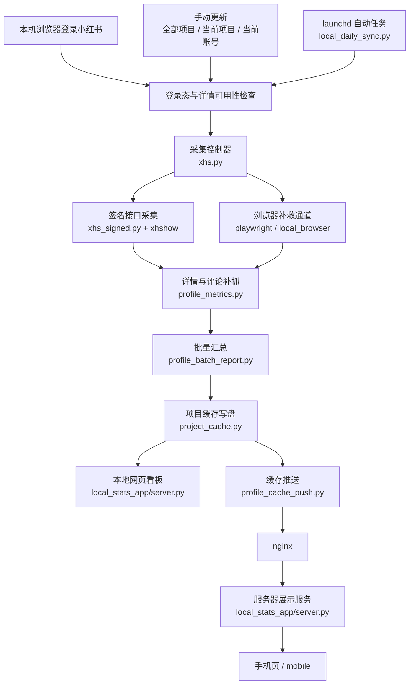
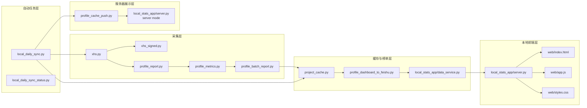

# 小红书本地采集与服务器查看技术架构

## 1. 文档范围

这份文档只描述**当前实际运行**的架构。

当前主线不是“本地采集后写飞书”，而是：

- 本地登录小红书并采集
- 本地生成缓存和看板
- 本机把缓存推送到服务器
- 服务器只负责展示
- 手机端只读取服务器缓存

历史飞书模块仍在仓库里，但不再是当前日常主路径。

## 2. 总体架构

### 2.1 当前架构

系统采用：

- 本地采集
- 本地缓存
- 本地前端
- `launchd` 自动任务
- 服务器缓存接收
- 服务器网页查看
- 手机端查看

### 2.3 当前链路图

### 2.2 核心原则

- 采集在本机完成，不在服务器抓小红书
- 已拿到的完整数据优先保留
- 不完整新结果不应覆盖完整旧结果
- 服务器不做实时计算，只读缓存
- 手机端只看服务器缓存，不触发采集

## 3. 当前模块分层

### 3.0 模块结构图

### 3.1 采集层

- [xhs.py](/Users/cc/Documents/New%20project/xhs_feishu_monitor/xhs.py)
  - 采集控制器
  - 调度 `requests / playwright / local_browser`
- [xhs_signed.py](/Users/cc/Documents/New%20project/xhs_feishu_monitor/xhs_signed.py)
  - 小红书签名接口封装
  - 实际依赖 [`xhshow`](https://github.com/Cloxl/xhshow)
- [profile_report.py](/Users/cc/Documents/New%20project/xhs_feishu_monitor/profile_report.py)
  - 单账号主页与作品列表报告
- [profile_metrics.py](/Users/cc/Documents/New%20project/xhs_feishu_monitor/profile_metrics.py)
  - 作品详情补抓
  - 评论数与评论摘要补抓
- [profile_batch_report.py](/Users/cc/Documents/New%20project/xhs_feishu_monitor/profile_batch_report.py)
  - 多账号批量采集

### 3.2 缓存与榜单层

- [project_cache.py](/Users/cc/Documents/New%20project/xhs_feishu_monitor/project_cache.py)
  - 项目缓存写盘
  - `tracked_works.json`
  - `tracked_work_history.json`
  - `ranking_rows.json`
  - `dashboard.json`
- [profile_dashboard_to_feishu.py](/Users/cc/Documents/New%20project/xhs_feishu_monitor/profile_dashboard_to_feishu.py)
  - 复用榜单、日历、趋势和字段构建逻辑
- [local_stats_app/data_service.py](/Users/cc/Documents/New%20project/xhs_feishu_monitor/local_stats_app/data_service.py)
  - 把缓存行转换成前端 payload

### 3.3 本地前端层

- [local_stats_app/server.py](/Users/cc/Documents/New%20project/xhs_feishu_monitor/local_stats_app/server.py)
  - 本地 HTTP 服务
  - 手动更新入口
  - 登录态检查
  - 本地面板数据构建
- [local_stats_app/web/index.html](/Users/cc/Documents/New%20project/xhs_feishu_monitor/local_stats_app/web/index.html)
- [local_stats_app/web/app.js](/Users/cc/Documents/New%20project/xhs_feishu_monitor/local_stats_app/web/app.js)
- [local_stats_app/web/styles.css](/Users/cc/Documents/New%20project/xhs_feishu_monitor/local_stats_app/web/styles.css)

### 3.4 自动任务层

- [local_daily_sync.py](/Users/cc/Documents/New%20project/xhs_feishu_monitor/local_daily_sync.py)
  - `launchd` 自动采集
  - 自动上传服务器
- [local_daily_sync_status.py](/Users/cc/Documents/New%20project/xhs_feishu_monitor/local_daily_sync_status.py)
  - 自动任务状态持久化

### 3.5 服务器展示层

- [profile_cache_push.py](/Users/cc/Documents/New%20project/xhs_feishu_monitor/profile_cache_push.py)
  - 本机把缓存推送到服务器
- [local_stats_app/server.py](/Users/cc/Documents/New%20project/xhs_feishu_monitor/local_stats_app/server.py)
  - 服务器也复用同一套服务
  - 但服务器模式只接收缓存和展示

## 4. 采集主链路

### 4.1 主通道

当前主通道是：

- `requests + xhshow`

职责：

- 主页分页
- 作品详情
- 评论预览

### 4.2 备用通道

备用通道是：

- `playwright`
- `local_browser`

职责：

- `requests` 不稳定时补救
- 本机交互登录
- 浏览器上下文采集

### 4.3 当前推荐模式

长期默认：

- `XHS_FETCH_MODE=requests`

当详情采集不稳时：

- 切到 `playwright`

当需要直接利用本机 Chrome 登录态时：

- 切到 `local_browser`

## 5. 本地缓存结构

默认缓存目录：

- [/Users/cc/Downloads/飞书缓存](/Users/cc/Downloads/%E9%A3%9E%E4%B9%A6%E7%BC%93%E5%AD%98)

每个项目目录里当前核心文件：

- `dashboard.json`
- `calendar_rows.json`
- `ranking_rows.json`
- `tracked_works.json`
- `tracked_work_history.json`
- `covers/`

### 5.1 tracked_works

作用：

- 保存当前作品级快照
- 保留 note 级指标
- 避免下一轮把完整旧值冲掉

### 5.2 tracked_work_history

作用：

- 保存跨天作品级历史
- 给“次日增长榜”提供昨天基线

### 5.3 ranking_rows

作用：

- 保存项目级榜单行
- 当前包含：
  - 点赞榜
  - 评论榜
  - 次日增长榜

当前重建逻辑已改成：

- 优先从 `tracked_works + tracked_work_history` 现场重算
- 不再单纯相信旧 `ranking_rows.json`

## 6. 看板数据口径

### 6.1 项目主卡

项目主卡显示的是：

- 项目粉丝总量
- 项目获赞收藏
- 项目评论总量

它们是**账号级汇总值**。

### 6.2 榜单条数

本地缓存状态里的：

- 点赞榜 `N 条`
- 评论榜 `N 条`
- 增长榜 `N 条`

是**榜单作品条数**，不是总量。

### 6.3 增长榜

增长榜成立条件：

- 同一作品前一天有历史记录
- 当前这天也抓到了这条作品

如果昨天历史不存在，就不会生成增长榜。

## 7. 完整性与回退策略

当前核心策略：

- 没登录，不开跑
- 样本账号详情不可用，不开跑
- 已拿到的精确数据优先保留
- 不完整新结果不能冲掉旧的完整结果

评论数当前口径：

- `精确值`
- `详情缺失`

当前主线不再把：

- 旧缓存值
- 评论下限值

伪装成当前精确值。

## 8. 本地更新与自动任务

### 8.1 手动更新

本地前端当前有 3 个入口：

- 更新全部项目
- 更新当前项目
- 更新当前账号

行为约束：

- `更新全部项目` 必须跑全部激活账号
- 自动任务运行中时，禁用手动“更新全部项目”
- 避免手动和自动任务互相覆盖

### 8.2 自动任务

当前自动任务基于 Mac `launchd`。

核心要求：

- 到点自动采集
- 未登录时不空跑
- 自动采集成功后再上传服务器

运行时状态文件：

- [/Users/cc/Documents/New project/xhs_feishu_monitor/.local_daily_sync_status.json](/Users/cc/Documents/New%20project/xhs_feishu_monitor/.local_daily_sync_status.json)

这个文件不属于业务数据，不应提交到 Git。

## 9. 服务器展示架构

### 9.1 当前服务器职责

服务器不采集小红书，只负责：

- 接收缓存上传
- 展示网页
- 展示手机页

### 9.2 当前公网入口

推荐入口：

- [http://47.87.68.74](http://47.87.68.74)

手机页：

- [http://47.87.68.74/mobile/index.html?project=默认项目](http://47.87.68.74/mobile/index.html?project=%E9%BB%98%E8%AE%A4%E9%A1%B9%E7%9B%AE)

当前公网访问通过 `nginx` 代理到本地服务，不再建议直接暴露 `:8787` 给公网。

## 10. 历史飞书模块的定位

仓库里仍然保留：

- [feishu.py](/Users/cc/Documents/New%20project/xhs_feishu_monitor/feishu.py)
- [profile_to_feishu.py](/Users/cc/Documents/New%20project/xhs_feishu_monitor/profile_to_feishu.py)
- [profile_dashboard_to_feishu.py](/Users/cc/Documents/New%20project/xhs_feishu_monitor/profile_dashboard_to_feishu.py)

原因：

- 历史兼容
- 复用榜单/日历/字段构建逻辑
- 某些导入桥接脚本仍会用到

但这些模块不再代表当前日常主线。

## 11. 当前主线一句话总结

当前项目的真实主线是：

- 本机登录采集
- 本机缓存与看板
- 本机推送服务器
- 服务器网页和手机页查看

这也是后续维护和优化应优先围绕的方向。
